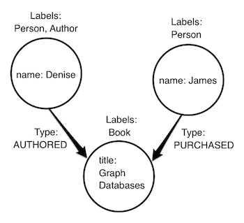

= Neo4j Application Development With Ruby
:level: Intermediate
:toc:
:toc-placement!: manual
:toc-title: Overview
:toclevels: 3
:section: Develop with Neo4j
:section-link: language-guides

[role="pull-right"]
--
toc::[]
--

.Goals
[abstract]
This course provides an overview on everything that you need to build a Neo4j application with the link:https://www.ruby-lang.org[Ruby programming language].

.Prerequisites
[abstract]
You should have Ruby installed on your system.

=== Introduction to Neo4j

Connected information is everywhere in our world.
Neo4j was built to efficiently store, handle and query highly connected elements in your data model.
With a powerful and flexible data model you can represent your real-world, variably structured information without a loss of fidelity.
The property graph model is easy to understand and handle, especially for object oriented and relational developers.

[role="pull-right"]
--

--

The property graph model consists of:

**Nodes** which have _properties_ and _labels_.

 * _properties_ are a schemaless key/value pair
 * _labels_ describe and group nodes much like tables group rows, but nodes can have multiple labels

**Relationships** which connect two nodes directionally have _properties_ and a _type_.

 * _properties_ are the same as described above
 * The relationship's _type_ gives a description of how it connects the two nodes
 * While relationships are directional, querying relationships in either direction has no associated performance cost

==== Cypher

Cypher is Neo4j's built-in query language.  Cypher queries look like:

[source,cypher]
----
MATCH (p:Person)-[:ACTED_IN]->(m:Movie)
WHERE m.name =~ '.*Matrix.*'
RETURN p, m.title
----

While it's possible to get started using the Neo4j.rb without learning Cypher, it is a very powerful way to query a Neo4j database and is worth learning.
Also since the Neo4j.rb project works by making Cypher queries to Neo4j it is good to understand Cypher as your queries get more complex.
There is also a link:/developer/cypher[Cypher tutorial] if you would like to learn more.

=== Importing data

There are many ways to import your existing data depending on how it is currently structured

 * link:http://neo4j.com/docs/stable/query-load-csv.html[**LOAD CSV**] is a clause built into Cypher which allows you to build your own import scripts
 * link:http://neo4j.com/docs/stable/import-tool.html[**neo4j-import**] is a binary command which comes with Neo4j and which takes files in a specific CSV format to import data very quickly
 * link:https://github.com/neo4jrb/neo4apis-activerecord[**neo4apis-activerecord**] is a good choice if you already have a project using `ActiveRecord`.  However it also works to import an existing SQL database even if you don't have any models defined
 * More??

Get more information on our link:/developer/working-with-data/[Working With Data] page.

// Seeding / Migrations?

// Should we do a choose-your-own-adventure sort of thing?  If somebody has an existing app they probably want a different guide from somebody starting from scratch (also if they have Neo4j already or not)

=== The Neo4j.rb Project

[role="pull-right"]
--
image::neo4jrb_logo.png[]
--

The link:http://neo4jrb.io/[Neo4j.rb project] is made up of the follow Ruby gems:

 * link:https://github.com/neo4jrb/neo4j[neo4j] A Object-Graph-Mapper (OGM) for the Neo4j graph database. It tries to follow API conventions established by ActiveRecord but with a Neo4j flavor.
 * link:https://github.com/neo4jrb/neo4j-core[neo4j-core] A low level driver for connecting to Neo4j. Used by the neo4j gem.
 * link:https://github.com/neo4jrb/neo4j-rake_tasks[neo4j-rake_tasks] A set of rake tasks for installing and managing a Neo4j database within your project. Used by the neo4j-core gem.

Using the Neo4j.rb project you can connect to a remote Neo4j server with any version of ruby or use JRuby to take advantage of Neo4j's Java APIs directly.

=== Setup

==== Community vs Enterprise

First you should choose and download the edition of Neo4j which is right for you.  See the link:http://neo4j.com/editions/[editions page] for more information.

If you are using Neo4j Enterprise edition you may want to consult link:http://neo4j.com/developer/guide-clustering-neo4j/[this guide] on configuring a high availability cluster.

As you are setting up your server to run Neo4j you should also consult this link:http://neo4j.com/developer/guide-sizing-and-hardware-calculator/[hardware requirements guide].

==== Ruby Web Application Frameworks

There is a link:https://www.youtube.com/playlist?list=PL5klM3mD6alLUhNTPTbj5a3GBjU7oZN0t[Neo4j.rb screencast series] which shows how to use Neo4j in a Ruby on Rails application.  Much of the material is also applicable in any Ruby application.

You can view sample application repositories for different frameworks below:

++++
<dl class="tabs" data-tab>
  <dd class="tab-title active"><a href="#rails">Ruby on Rails</a></dd>
  <dd class="tab-title"><a href="#sinatra">Sinatra</a></dd>
</dl>
++++

++++

++++

[[rails]]
[.content.active]
===== Example Ruby on Rails Applications

 * link:https://github.com/neo4j-examples/movies-with-neo4j[Movies with Neo4j] A simple example of a Rails app using Neo4j's built-in movie dataset
 * link:https://github.com/neo4j-examples/asset_portal[Asset Portal] A more advanced Rails application with Neo4j
 * link:https://github.com/neo4jrb/swapi[Star Wars API] A Rails application which imports and displays data from link:https://swapi.co/[swapi.co]

This video shows you how to set up a new Rails application with Neo4j:

++++
<iframe width="560" height="315" src="https://www.youtube.com/embed/n0P0pOP34Mw?list=PL5klM3mD6alLUhNTPTbj5a3GBjU7oZN0t" frameborder="0" allowfullscreen></iframe>
++++

[[sinatra]]
[.content]
===== Example Sinatra Applications

There are two Sinatra apps which use Neo4j to implement the link:http://neo4j.com/developer/example-project/[Neo4j example application]

 * link:https://github.com/neo4j-examples/movies-ruby-neo4j-core[Using neo4j-core]
 * link:https://github.com/neo4j-examples/movies-ruby-neo4jrb[Using neo4j] (``ActiveNode`` and ``ActiveRel``)

++++

++++

==== Gem integrations

There are many common gems that you'll want to use with your Neo4j database.  Many are supported for the Neo4j.rb project:

++++
<table style="width: 100%">
<tr>
<td>
++++

===== Authentication

 * link:https://github.com/neo4jrb/devise-neo4j[devise-neo4j]

===== File Attachment

 * link:https://github.com/neo4jrb/neo4jrb-paperclip[neo4jrb-paperclip]
 * link:https://github.com/neo4jrb/carrierwave-neo4j[carrierwave-neo4j]

===== Pagination

 * link:https://github.com/neo4jrb/neo4j-will_paginate_redux[neo4j-will_paginate_redux]
 * link:https://github.com/megorei/kaminari-neo4j[kaminari-neo4j]

++++
</td>
<td>
++++

===== ElasticSearch Integration

 * link:https://github.com/neo4jrb/neo4j-searchkick[neo4j-searchkick]

===== Admin User Interface

 * link:https://github.com/cheerfulstoic/rails_admin[rails_admin]

===== Integration With the link:https://github.com/neo4j-contrib/spatial[Neo4j Spatial Plugin]

 * link:https://github.com/neo4jrb/neo4jrb_spatial[neo4jrb_spatial]

++++
</td>
</tr>
</table>
++++
