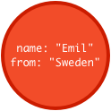
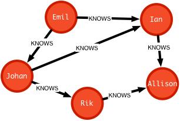
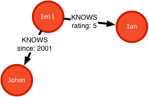

== What is a graph database?

A graph database manages real world information efficiently in an appropriate data model consisting of nodes (vertex) connected by named, directed relationships (edges). Nodes and relationships capture the structural and semantic meaning of your data. Properties on each provide a place to store the actual data.

Most graph databases are schema free, supporting quick, agile development and fast evolution of your domain. 
The flexible model allows for many different use-cases to be handled by the same data. 
The information about how your graph data is used, lives in the applications you write.

If you're used to drawing models of your domain on whiteboards or in diagrams, you've alredy used graph representations. And now you're able to continue to use the same, well suited modeling concepts not only in your design and application but even in your database.

For developers experienced in object oriented programming or entity-relationship-diagrams (which are actually graphs) the step to the similar but more versatile and powerful graph model should be a small one.

It not only provides a memory model of that graph data, but also persistence storage with optimized representations for graph concepts on disk. 

As graph databases use a fine-grained, very normalized data model, they provide transactional safety for sets of update operations. You wouldn't want your business transaction to be only partially applied in your graph.

The transactional guarantees known from relational databases (Atomicity, Consistency, Isolation and Durability - ACID) make sure your data will be persistent after being committed and recovered after failures.

As a graph database is optimized for managing relationships (by storing them as real database records) it can quickly retrieve them as part of complex query or traversal operations.

That's why graph databases outperform other database which have to compute connections between records expensively at query time.

Neo4j as an open-source graph database supports all the aforementioned aspects.

Advanced features such as High Availability, Scale-out, Failover and Monitoring are also supported in http://neo4j.com/business-subscription/?edition=enterprise&release=2.1.4[Neo4j's Enterprise] offering.

Let's look at some examples.

** TODO BETTER EXAMPLES **

== Core concepts

A graph database can store any kind of data using a few simple concepts represent information and structure

* Nodes – graph data records
* Relationships – connect nodes
* Properties – named attribute values
* Labels - assign roles to nodes

== A Graph Database

Neo4j stores data in a Graph, with records called Nodes.

== Create a node

The simplest graph has just a single node with some attributes. Let’s create a social graph of our friends on the Neo4j team:

. Start by drawing a circle for the node
. Add the name _Emil_
. Note that he is from _Sweden_ //todo Sweden as relationship

image::img/one_node.png[]

[TIP]
====
* Nodes are the name for entities in a graph
* Data is stored as properties
* Properties are simple name/value pairs
====

== Add a Label

Labels associate a set of nodes and assign roles to a node.

Nodes can be categorized by applying labels. In our social graph, we’ll label each node that represents a Person.

. Apply the label “Person” to the node we created for Emil
. Color “Person” nodes red

[TIP]
====
* A node can have multiple labels
* Labels do not have any properties
* Labeled Node
* More Nodes
* Schema-free, nodes can have a mix of common and unique properties.
====

== More Nodes

Like any database, storing data in Neo4j can be as simple as adding more records. We’ll add a few more nodes, representing the following facts:

. Emil has a klout score of 99
. Johan, from Sweden, who is learning to surf
. Ian, from England, who is an author
. Rik, from Belgium, has a cat named Orval
. Allison, from California, who surfs

image::img/more_nodes.png[]

[TIP]
====
* Similar nodes can have different properties
* Properties can be strings, numbers, or booleans
* Neo4j can store billions of nodes
====

== Consider Relationships

Relationships connect nodes in the graph.

The real power of Neo4j is in connected data. To associate any two nodes, add a Relationship which describes how the records are related.

In our social graph, we simply say who KNOWS whom:

. Emil KNOWS Johan and Ian
. Johan KNOWS Ian and Rik
. Rik and Ian KNOWS Allison

[TIP]
====
* Relationships always have direction
* Relationships always have a type
* Relationships form patterns of structural connections
* Relationship properties store information shared by two nodes.
* Relationships are qualified by their properties.
====

== Relationship properties

Relationships properties store information qualifying the relationships between two nodes.

In a property graph, relationships are data records that can also contain attributes. Looking more closely at Emil’s relationships, note that:

* Emil has known Johan since 2001
* Emil rates Ian 5 (out of 5)
* Everyone else has similar relationship properties

Want more details? Please refer to the http://docs.neo4j.org/chunked/stable/what-is-a-graphdb.html#_neo4j_is_a_graph_database[Neo4j Manual].
