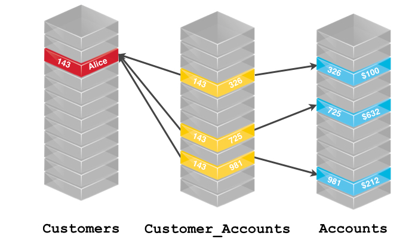
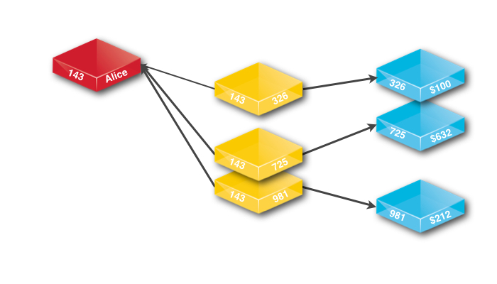
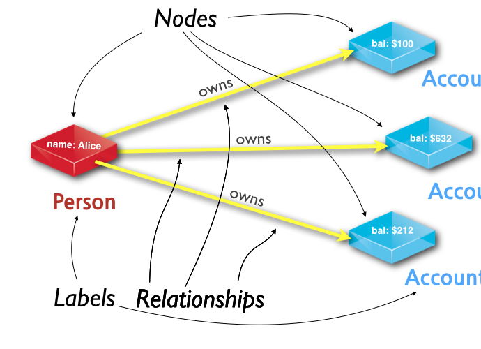

= Graph Databases versus Relational Databases
:level: Beginner
:toc:
:toc-placement!:
:toc-title: Overview
:toclevels: 1

.Goals
[abstract]
We live in a connected world. There are no isolated pieces of information, but rich, connected domains all around us.

.Prerequisites
[abstract]
Nodes can be tagged with zero to many labels representing their different roles in the domain. In addition to contextualizing node and relationship properties, labels may also serve to attach metadata—​index or constraint information, for example—​to nodes.

[role=expertise]
{level}

=== TODO
* polyglot setup, integration with relational db's
* data import from relational (short section with link to data import)
* guides / tips for relational database developers / DBA's

=== Relational Databases

Relational Databases have been the power-horse of software applications since the 80's.
Every relevant system used a relational database to store and query its data.

Relational databases store highly structured data in tables with fixed numbers and types of columns and many rows of the same type of information.
The structure is recorded in a fixed schema that all data in the database has to adhere to.
If you want to change your model, you have to change the schema and for that you had to work your way by the database administrator.
And don't try this more than once per week.

Despite having "relational" in its name, the data model is not about connections but about _Relational Algebra_, a set algebra.

References to other rows and tables are indicated by referring to their key attributes, enforcable with constraints only when the connection is never optional.

Relationships are computed at query time by matching primary and foreign keys of the many (potentially indexed) rows of the to be joined tables.
This operation is CPU and RAM intensive and has an exponential cost.

.Relational databases also lack relationships
[quote, "Jim Webber, Ian Robinson", "Graph Databases, O'Reilly"]
For several decades, developers have tried to accommodate connected, semi- structured datasets inside relational databases. But whereas relational databases were initially designed to codify paper forms and tabular structures — something they do exceedingly well — they struggle when attempting to model the ad hoc, exceptional relationships that crop up in the real world. +
*Ironically, relational databases deal poorly with relationships. Relationships do exist in the vernacular of relational databases, but only as a means of joining tables.*

If you had to manage many-to-many relationships, just listing a foreign key did not cut it.
You had to introduce another "dummy" _JOIN_ table that listed foreign keys of both participating tables.
And so those join operations immediately doubled in complexity and cost.

Those costly join operations, made the database administrator take your nice little model, that you created lovingly with no unneccessary redundancies and denormalized it to make it fly.

Not every use-case was a good fit for this type of datamodel but for the lack of well known alternatives, you worked around this fact.
At least you tried.

Many tools competed to make life with relational databases easier, and they did.

It was convenient to know the common data model and widespread query language SQL.
If you knew one relational database, you knew all, execpt fo the devil that was in the detail.
Of thousands of configuration and tuning options, vendor specific SQL extensions and specialized tools for operating and managing the database.

=== Relational to Graph

